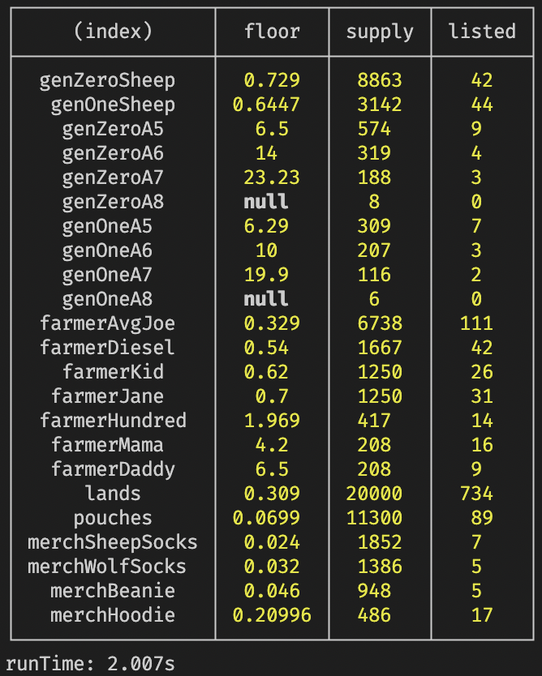

# 🐺 WG Stats API

> Get latest floor prices for all collections in the WG ecosystem

### Scripts

#### `npm run start:dev`

Get floor prices, supply count and listed count of all collections

#### `npm run start:dev -- --tokens=farmers`

Fetch and save all farmer tokens into `farmers.json`

#### `npm run start:dev -- --tokens=animals`

Fetch and save all animal tokens into `animals.json`

#### `npm run start:dev -- --tokens=lands`

Fetch and save all animal tokens into `lands.json`

#### `npm run test`

Runs the `jest` tests once.

#### `npm run test:dev`

Run the `jest` tests in watch mode, waiting for file changes.

#### `npm run prettier-format`

Format the code.

#### `npm run prettier-watch`

Format the code in watch mode, waiting for file changes.
